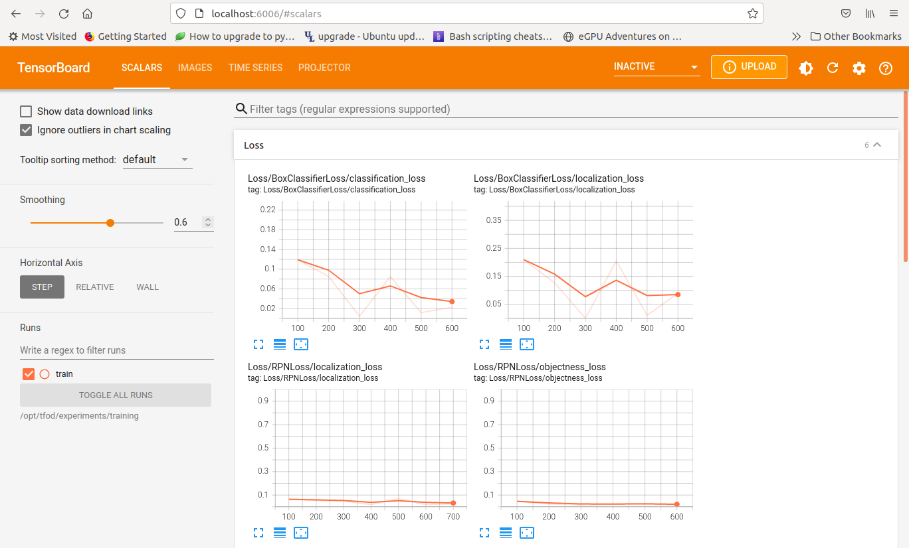
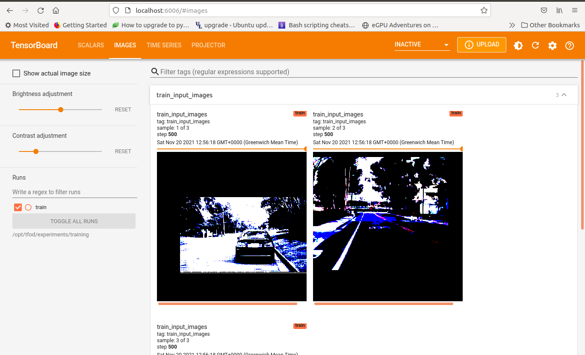
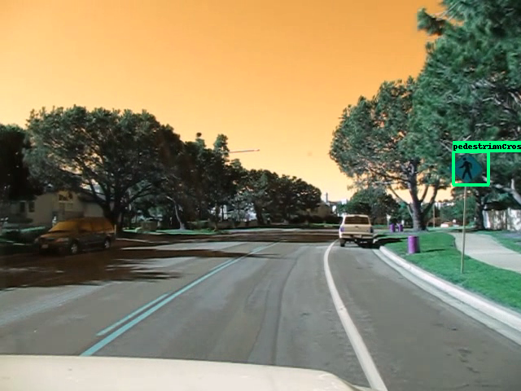
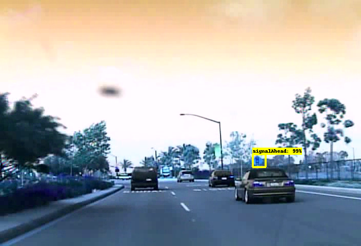

### M1L0 TFOD Toolkit

[Prepare the dataset]: https://tensorflow-object-detection-api-tutorial.readthedocs.io/en/latest/training.html#preparing-the-dataset

[LISA Traffic signs dataset]: http://cvrr.ucsd.edu/LISA/lisa-traffic-sign-dataset.html

[List of models]: https://github.com/tensorflow/models/blob/master/research/object_detection/g3doc/tf2_detection_zoo.md

[EC2 instance types]: https://aws.amazon.com/ec2/instance-types/

[TaskDef docs]: https://docs.aws.amazon.com/AmazonECS/latest/developerguide/task_definition_parameters.html

[M1L0 Artifacts sidecar]: https://hub.docker.com/r/m1l0/artifactsv2

[sample TFOD project]: https://github.com/cheeyeo/tfod_rcnn_example


Simple set of utils to work with TensorFlow Object detection framework V2.

It packages the TFOD model zoo into a docker container with a custom training script to train a specific object detector on AWS ECS.

It also includes a set of terraform scripts to help with AWS deployment.


**NOTE** There is no support for the preparation of datasets for training with TFOD as its impossible to preempt how the dataset is annotated, in what format, and how to extract the bounding box target values. As such I refer you to the [Prepare the dataset] section on the TFOD documentation or refer to this [sample TFOD project] for more ideas.


### Local Manual Setup

This involves cloning this repository and using it as a new project base


The steps are as follows:

* Clone this repo and cd into it

* Clone the TF models repo:
	```
	git clone https://github.com/tensorflow/models.git

	git config submodule.models.ignore all

	cd models/research/

	protoc object_detection/protos/*.proto --python_out=.

	cp object_detection/packages/tf2/setup.py .

	python3 -m venv myvenv && source myvenv/bin/activate

	python3 -m pip install .

	# if no errors then it works...
	python object_detection/builders/model_builder_tf2_test.py
	```

* [Prepare the dataset] as documented

* Create separate local dirs for training, exported model and for the TFRecords.

* The train.sh script will automatically use the default training config if no overrides is given. If you need to overrwrite sections of the config, you need to provide a config override file and a hyperparams override in json

* Run **train.sh** manually:
	```
	./train.sh models <model training dir> <exported_model_directory> <tf records dir> "<model name>" <training config overrides>.config <training params overrides>.json
	```

* A separate instance of Tensorboard will also be running in the background at port 6006


### Local Docker Setup

* Build the image and push it to AWS ECR / Dockerhub or use it locally.

	```
	docker build -t mytofd:latest -f Dockerfile .

	# optional but needed to run on AWS
	docker push mytfod:latest
	```

* To run locally:
	```
	export LOCAL_DATA_PATH="dataset"

	docker run \
	--gpus all \
	--rm \
	-p 6006:6006 \
	-v"${LOCAL_CONFIG_FILES}":/opt/tfod/configs \
	-v"${LOCAL_DATA_PATH}":/opt/tfod/records \ -v"${LOCAL_SAVED_MODEL_PATH}":/opt/tfod/experiments/exported_model \
	m1l0/tfod:latest \
	"models" \
	"experiments/training" \
	"experiments/exported_model" \
	"records" \
	"Faster R-CNN ResNet101 V1 800x1333" \
	configs/training.config \
	configs/traininghparams.json
	```

	The docker image has a working dir of **/opt/tfod** and the above binds the local records dir into **/opt/tfod/records**; the saved model path into **/opt/tfod/experiments/exported_model** and the config files into **/opt/tfod/configs**

	It also starts Tensorboard on port 6006 which you can view via localhost.

	The arguments are passed to `train.sh` as follows:
	* "models": dir of cloned tfod models repo in container
	* "experiments/training": working dir to store model checkpoints
	* "experiments/exported_model": directory where exported model after training is saved
	* "records": directory of records path in container

	The remaining arguments are used by `readconfig.py` to generate a custom training config file:

	* "Faster R-CNN ResNet101 V1 800x1333": name of pretrained model to use. Refer to the following [List of models]

	* "training.config": Custom config file to overwrite the default provided model config. It not provided, the training will use the default provided. e.g:
	```
	  train_config: {
		  optimizer: {
		    momentum_optimizer: {
		      learning_rate: {
		        manual_step_learning_rate {
		          initial_learning_rate: 0.0003
		          schedule {
		            step: 900000
		            learning_rate: .00003
		          }
		          schedule {
		            step: 1200000
		            learning_rate: .000003
		          }
		        }
		      }
		      momentum_optimizer_value: 0.9
		    }
		    use_moving_average: false
		  }
		}
	```

	* "traininghparams.json": JSON dict of model's hyper parameters to overwrite during training. e.g:
	```
		{
		  "num_classes": 3,
		  "batch_size": 1,
		  "train_steps": 50000,
		  "num_examples": 955,
		  "learning_rate": 0.0003,
		  "fine_tune_checkpoint_type": "detection"
		}
	```

	The `readconfig.py script` will merge the above and create a custom training config file


### AWS Setup

For training on ECS, the terraform scripts create the following resources:

* Custom VPC with 1 public subnet, 1 private subnets
* ECS cluster
* Required security groups and IAM roles
* 1 EC2 GPU container instance
* Task definition 

Pre-requisities:

* Build and deploy the m1l0/tfod image using the dockerfile provided.

* Upload the local training config and hparams json files into an s3 bucket

* The [M1L0 Artifacts sidecar] image is defined in the task defintion via config.tfvars and will be used as sidecar container to backup training artifacts to S3

* Edit `terraform/config.tfvars` with the right parameters.

* Run `make setup` to setup terraform

* Run `make apply` to provision the resources

* Check the container instance has connected to the cluster ( check the ECS Agent tab for the cluster). This may take a few minutes depending on the ec2 instance type

* Run `make runtask-config` to generate a configs.json file in the local working directory

* Run `runtask.sh` with the following parameters:
	```
	./runtask.sh configs.json s3://<records_bucket> "Faster R-CNN ResNet101 V1 800x1333" s3://<train config file> s3://<model hparams config file>
	```

	The script will create an ECS task; sets up local port forwarding to access Tensorboard using SSM; and tails the training logs.

	**NOTE** The script does not exit even if logs have stopped. You need to exit the script manually. 

* If successful, you should see a stream of the logs:

	```
	...

	2021-11-13T21:47:13 INFO:tensorflow:Step 48100 per-step time 0.117s
	2021-11-13T21:47:13 I1113 21:47:13.077878 140227122984768 model_lib_v2.py:700] Step 48100 per-step time 0.117s
	2021-11-13T21:47:13 INFO:tensorflow:{'Loss/BoxClassifierLoss/classification_loss': 0.005494753,
	2021-11-13T21:47:13  'Loss/BoxClassifierLoss/localization_loss': 0.029663853,
	2021-11-13T21:47:13  'Loss/RPNLoss/localization_loss': 0.0020761527,
	2021-11-13T21:47:13  'Loss/RPNLoss/objectness_loss': 0.00037709906,
	2021-11-13T21:47:13  'Loss/regularization_loss': 0.0,
	2021-11-13T21:47:13  'Loss/total_loss': 0.037611857,
	2021-11-13T21:47:13  'learning_rate': 3.7432907e-05}
	2021-11-13T21:47:13 I1113 21:47:13.078210 140227122984768 model_lib_v2.py:701] {'Loss/BoxClassifierLoss/classification_loss': 0.005494753,
	2021-11-13T21:47:13  'Loss/BoxClassifierLoss/localization_loss': 0.029663853,
	2021-11-13T21:47:13  'Loss/RPNLoss/localization_loss': 0.0020761527,
	2021-11-13T21:47:13  'Loss/RPNLoss/objectness_loss': 0.00037709906,
	2021-11-13T21:47:13  'Loss/regularization_loss': 0.0,
	2021-11-13T21:47:13  'Loss/total_loss': 0.037611857,
	2021-11-13T21:47:13  'learning_rate': 3.7432907e-05}
	2021-11-13T21:47:22 INFO:tensorflow:Step 48200 per-step time 0.090s
	2021-11-13T21:47:22 I1113 21:47:22.030618 140227122984768 model_lib_v2.py:700] Step 48200 per-step time 0.090s
	...
	```

	The `runtask.sh` script creates a local port for viewing the remote tensorboard instance using SSM:
	```
	aws ssm start-session --target ${container_id} --document-name AWS-StartPortForwardingSession --parameters '{"portNumber":["6006"], "localPortNumber":["6006"]}'
	```

	You can open a browser window to localhost:6006 to view tensorboard data. Note that it may take a while before any data shows up. Please note that at this point, tensorboard is running remotely on the container instance, not on localhost itself. Below are some screenshots of port forwarding from remote to localhost:

	
	


* Check the backup_target specified for the artifacts in config.tfvars. You should see 2 subfolders in the bucket: `training` and `exported_model`

	The `exported_model` contains the final trained model.

* Exported the saved model to localhost for inference:
	
	```
	aws s3 --recursive s3://exported_model <local dir>
	```

* Test the model with the `predict.py` script:

	```
	python predict.py \
	 --model exported_model \
	 --labels records_dir/classes.pbtxt \
	 --images "image1, image2" 
	 --output_dir "results" \
	 --output_file_prefix "result"
	 --min_confidence 0.5
	```
	The script detects and localizes the found objects within each image by drawing bounding boxes and class label for each of them.

Below are some samples of inference for a model trained on the [LISA Traffic signs dataset]:






### Issues

* Note that when using manual local setup, the `python3 -m pip install .` will cause `opencv-headless` to also be installed. Need to remove it if running on desktop and reinstall `opencv-contrib-python`


* If you are cloning this repo and using it as a base project, you need to ignore the clone models submodule:
	```
	git config submodule.models.ignore all
	```

* Note that the **batch_size** must match the num of GPUs/TPUs 


* **NOTE**: Sometimes the provision of p3 ec2 instances might fail due to insufficient resources in the AZ. Change the subnet_id in the ecs instance block in `main.tf` until it works. As of this writing, I am unable to provision beyond `p3.2xlarge` instances.

* The ecs instance profile may already exists so need to delete it if it does:

	```
	aws iam list-instance-profiles

	aws iam delete-instance-profile --instance-profile tfod-ecsInstanceProfile
	```

* Number of GPUS used have to match the batch_size in config file else it fails with:

	```
	ValueError: The `global_batch_size` 1 is not divisible by `num_replicas_in_sync` 4 
	```

* Multi-gpu training is still not possible with v2 version. It fails remotely with `NCCL issues` ??


### References

[Prepare the dataset]

[List of models]

[sample TFOD project]